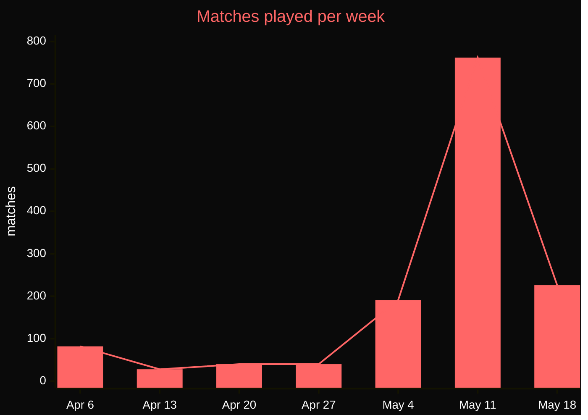

<h1 align="center">Hi, I'm Kieran 👋</h1>

  <em>Software Engineer @ ASML · Founder of <a href="https://peekseek.net">PeekSeek</a> & <a href="https://algostudio.io">AlgoStudio</a> · Python for 10+ years</em>

  
  
  

---

### About me

Long-time Python developer. Over a decade in and it still feels like the right tool for most of what I want to build. By day I'm a **Software Engineer at ASML**, splitting time between production software, internal Python tooling, and the data-science work behind it. Outside ASML I design, build, and operate two products on my own.

## Projects

<table>
<tr>
<td width="50%" valign="top">

  
  &nbsp;
  

### [PeekSeek.net](https://peekseek.net)

<em>Founder & sole developer</em>

The first-ever competitive matchmaking platform for *Unturned*, officially partnered with **[Smartly Dressed Games](https://smartlydressedgames.com/)**, the studio behind Unturned.

ELO-based queues · Steam auth · in-browser kit editor · dedicated match servers · self-funded seasonal tournament (the **Unturned Competitive League**).

  
  
  
  
  

</td>
<td width="50%" valign="top">

### 🧑‍🏫 [AlgoStudio.io](https://algostudio.io)

<em>Founder & sole developer</em>

A teaching platform for algorithms and CS fundamentals, **in use across schools in the Netherlands**.

Teachers author problems in plain markdown with test cases; students get a single-screen view of problem, editor, and live test feedback.

Built from scratch. No frameworks, no build step, deliberately fast.

</td>
</tr>
</table>

### PeekSeek growth · matches played per week since launch

Pulled live from PeekSeek production. Week of May 11 includes a UCL tournament weekend.

## Principles I build by

<table>
<tr>
<td width="50%" valign="top">

### 🔁 DRY

<strong>Don't Repeat Yourself.</strong> Duplication is the root of bugs that drift apart over time. If two pieces of code know the same thing, they share an abstraction, or one of them is wrong.

</td>
<td width="50%" valign="top">

### 📐 Never Nesting

<strong>Flatten with early returns and inversion.</strong> Deep nesting hides logic and breeds bugs. If I'm three levels deep, I extract a function or flip a guard.

</td>
</tr>
<tr>
<td width="50%" valign="top">

### 💬 Comments explain *why*, not *what*

<strong>Self-documenting code.</strong> Good names beat comments. The only comments worth writing capture a constraint, surprise, or workaround the code itself can't express.

</td>
<td width="50%" valign="top">

### 🐳 Always containerize

<strong>If it doesn't run in a container, it doesn't really run.</strong> Reproducibility from day one. Same environment locally, in CI, and in prod. No "works on my machine."

</td>
</tr>
</table>

## GitHub at a glance

  
  

  

## Work with me

- 💼 **Hiring.** Open to senior / staff Python roles, platform & data engineering, or technical co-founder conversations.
- 🤝 **Collaboration.** On PeekSeek, AlgoStudio, or your project if the problem is interesting.
- 💖 **[Sponsor me on GitHub](https://github.com/sponsors/kvandeh).** Sponsorship directly funds **PeekSeek's tournament prize pools** and keeps **AlgoStudio free for schools**. Every euro goes back into the platforms.

  📫 <a href="mailto:kieran.van.der.heijde@gmail.com">kieran.van.der.heijde@gmail.com</a>
  &nbsp;·&nbsp;
  💼 <a href="https://www.linkedin.com/in/kcvdh">LinkedIn</a>
  &nbsp;·&nbsp;
  💖 <a href="https://github.com/sponsors/kvandeh">Sponsor</a>

